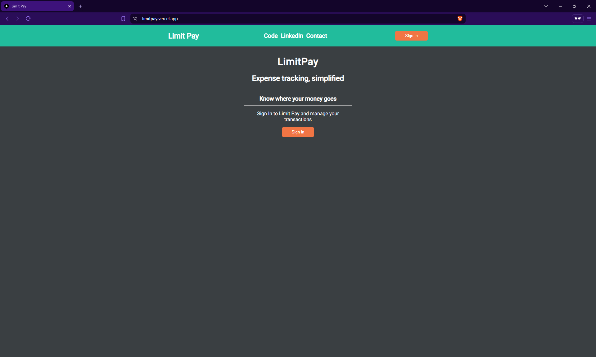
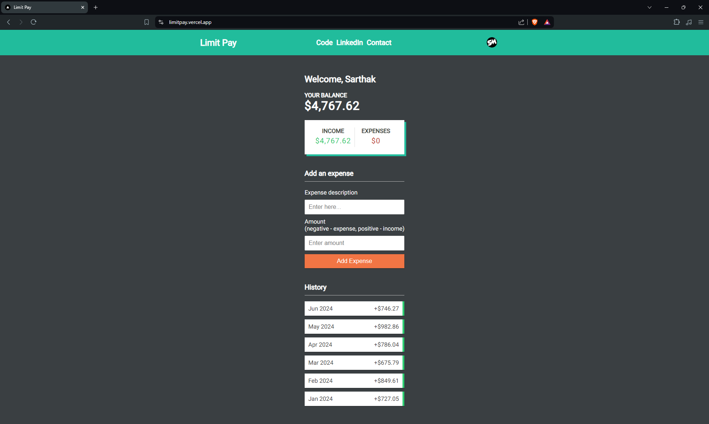

# LimitPay
LimitPay is a user-friendly expense tracking application that helps users manage their finances effectively. Users can create an account, add income and expenses, view their expense history, and keep track of their balance, all within a sleek and intuitive interface.

## Key Features
- **User Authentication:** Secure user registration and login using Clerk.
- **Expense Tracking:** Add and categorize income and expenses easily.
- **Expense History:** View a detailed history of all expenses and incomes.
- **Balance Overview:** Keep track of your current balance.
- **User-Friendly Interface:** Enjoy a great UI designed for ease of use and efficiency.

## Short Description
LimitPay is an expense tracking application built with Next.js. It provides users with a seamless experience to track their income and expenses, view their transaction history, and monitor their balance. The application uses Clerk for authentication and relies on Postgres and NeonDB for database management. The app is deployed on Vercel, ensuring high performance and reliability.

## Snippets
<h3>LimitPay Landing Page</h3>

<h3>LimitPay Home</h3>

## Tech Used
- **Frontend:** Next.js, React.js, CSS
- **Authentication:** Clerk
- **Database:** Postgres, NeonDB
- **Deployment:** Vercel

## How to Use

1. Clone the repository: `git clone https://github.com/sarthakmishraa/limitpay-expense-tracker.git`

Feel free to clone the repository and explore the project. Contributions are welcome!